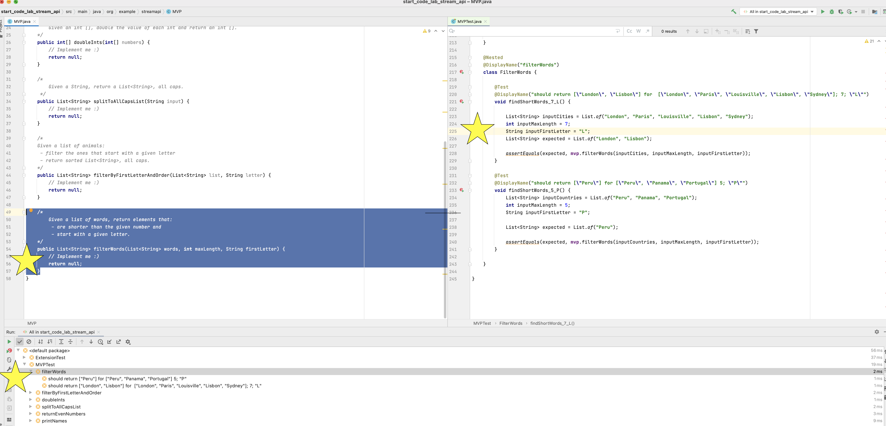

# Lab - Stream API & Lambdas

Stream API is the cornerstone of modern Java programming. 
Since lambdas are an inherent part of Stream API, you'll practice them in this lab.

## MVP

    Start with this class - this is your task.

## Extension - if time permits

    Some additional exercises to help you hone your skills - may require some investigation (Stack Overflow, Baeldung etc.)

### Class MVP and Extension have some unimplemented methods. Use method's names, comments and tests to deliver the task.

